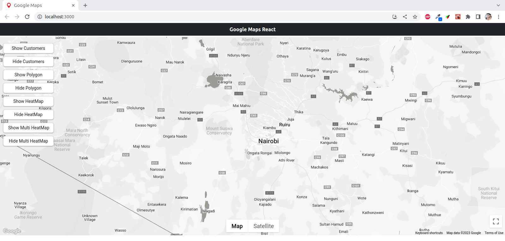
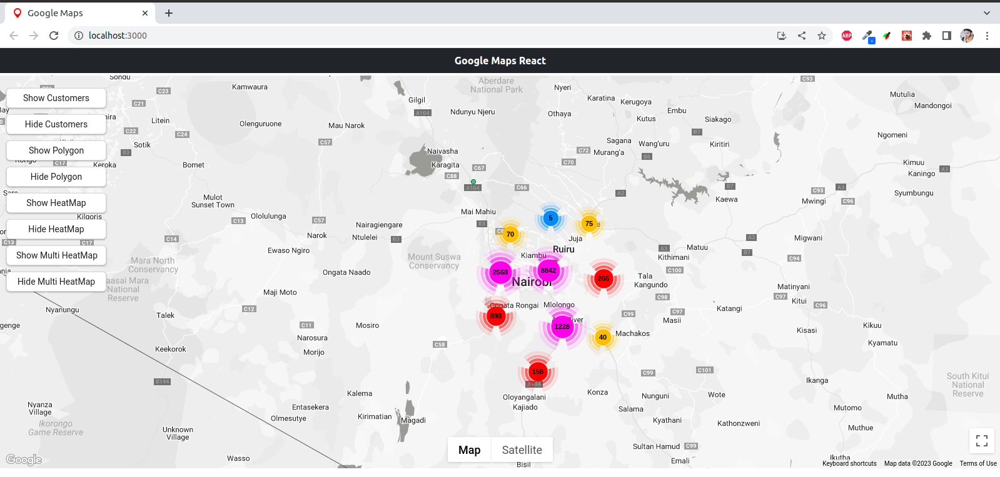
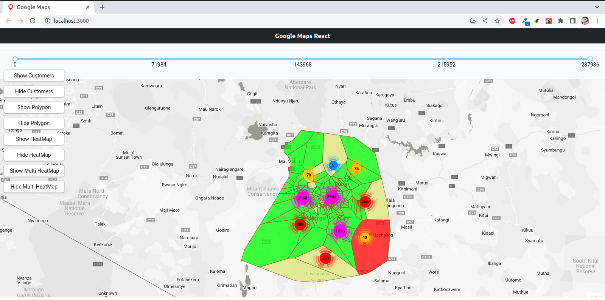
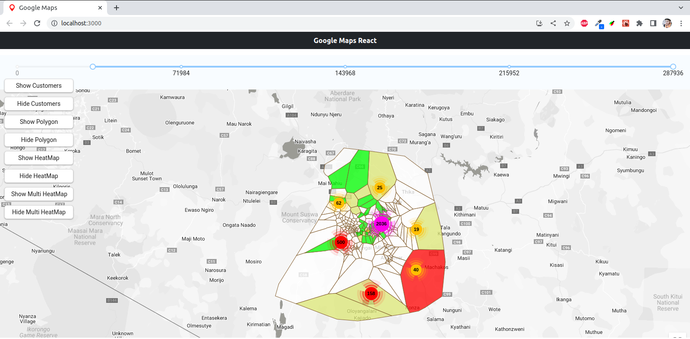
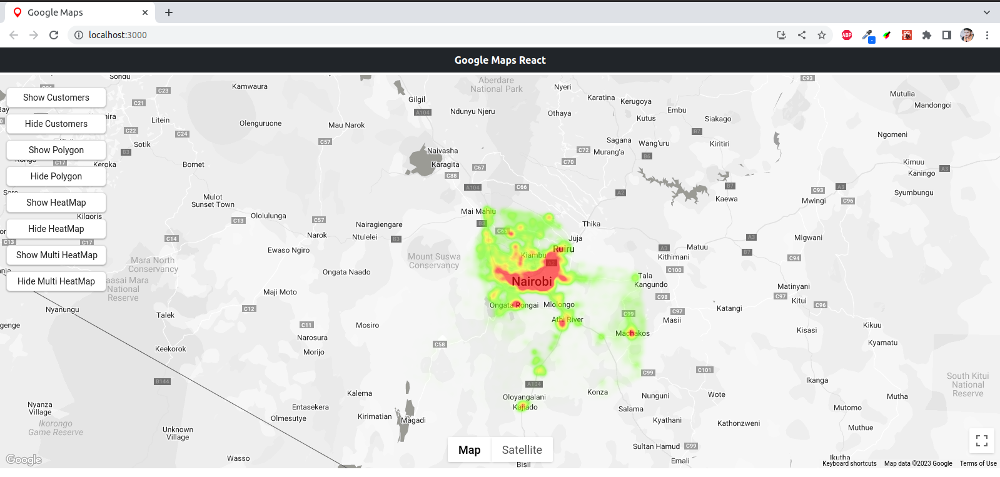
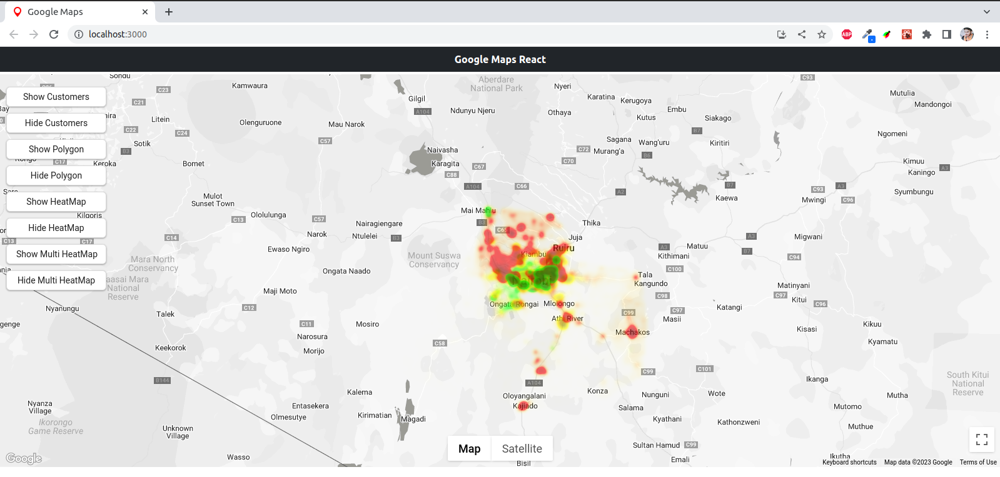

Readme.md

React Google Maps is a web application that utilizes the Google Maps API to display various features such as markers, marker clusters, polygons, heat maps, and multi-level heat maps.

## Getting Started

1.  Clone the repository by running `git clone https://github.com/mumerabid/google-maps-api.git` in your terminal.
2.  Navigate to the project directory by running `cd google-maps-api`.
3.  Install the required dependencies by running `npm install`.
4.  Obtain a Google Maps API key from the [Google Cloud Console](https://console.cloud.google.com/).
5.  Create a `.env` file in the root directory of the project and add the following line: `REACT_APP_GOOGLE_MAPS_API_KEY=YOUR_API_KEY`, where `YOUR_API_KEY` is your Google Maps API key.
6.  Start the application by running `npm start`.

## Libraries Used

The following libraries were used in the creation of this application:

- [React](https://reactjs.org/)
- [Google Maps API](https://developers.google.com/maps/documentation)
- [google-map-react](https://github.com/google-map-react/google-map-react)
- [@googlemaps/markerclustererplus](https://www.npmjs.com/package/@googlemaps/markerclustererplus)
- [Bootstrap](https://getbootstrap.com/)

## Features

The React Google Maps application includes the following features:

- Markers with customized icons and pop-up information on click
- Marker clusters for improved performance
- Polygons with customized colors and pop-up information on click
- Heat maps with gradient colors based on data density
- Multi-level heat maps with multiple layers of data

## How to Use

To use the application, follow the steps below:

1.  Navigate to the desired location on the map by dragging the map or using the search bar.
2.  Click on a marker to view its name.
3.  Click on a polygon to view its associated data.
4.  Toggle the marker cluster display using the button in the top-right corner of the map.
5.  Toggle the heat map display using the button in the top-right corner of the map.
6.  Toggle the multi-level heat map layers using the button in the top-right corner of the map.

## Contributing

Contributions to this project are welcome. To contribute, follow the steps below:

1.  Fork the repository and create a new branch for your changes.
2.  Make your changes and ensure they are fully tested.
3.  Create a pull request and include a detailed description of your changes.
4.  Wait for feedback and address any requested changes.
5.  After approval, your changes will be merged into the main branch.

## Map

## Markers with Marker cluster

## Polygons

## Polygons and and markers according to selected population range

## Heat Map

## Multilevel Heat Map

# Happy Coding!
